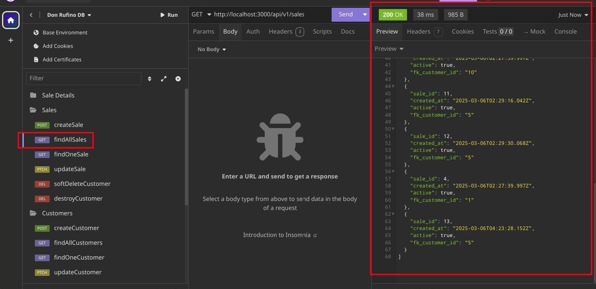
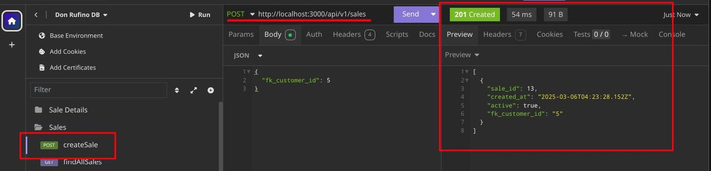
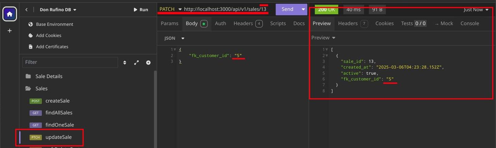
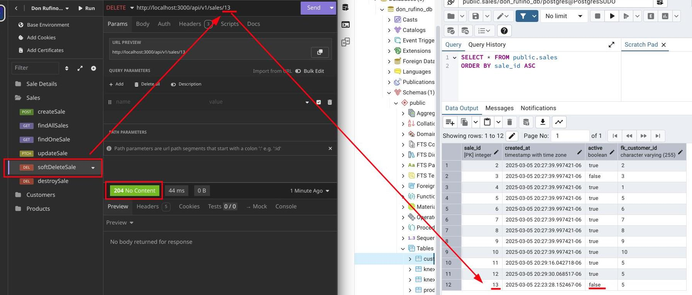
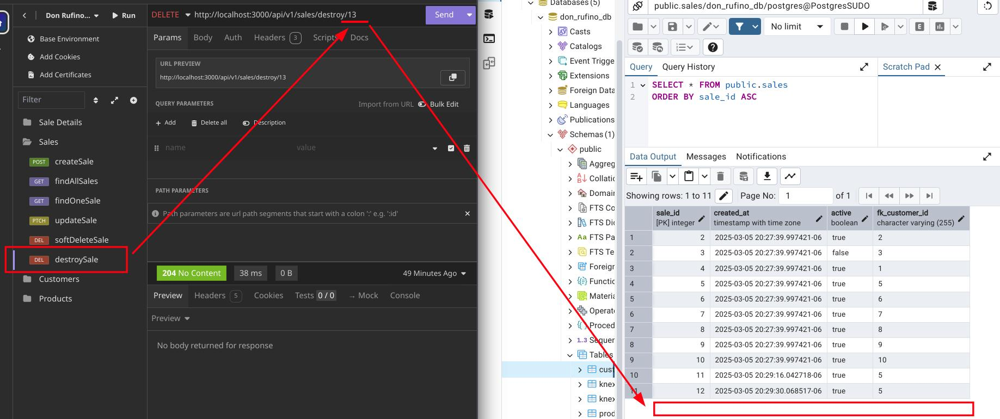
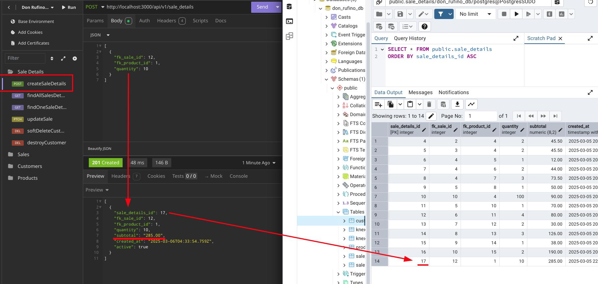
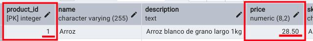
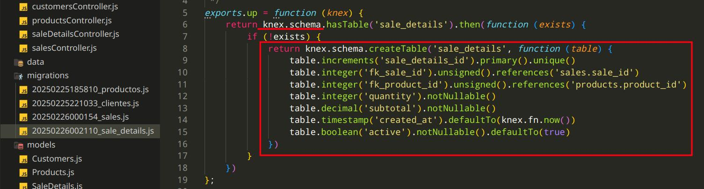
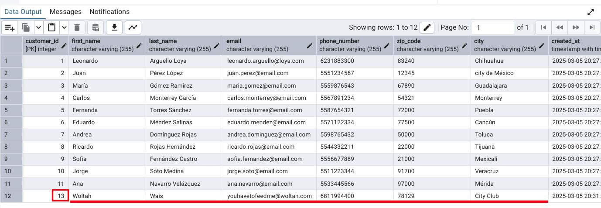
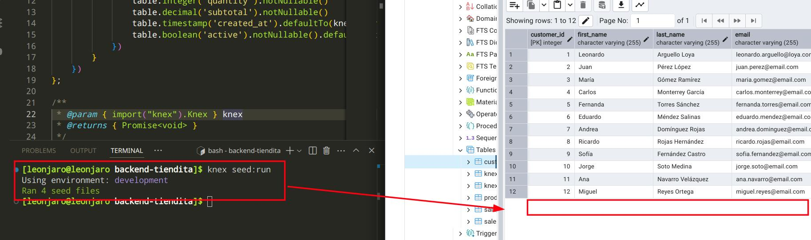

# Sales API - Backend

This is a REST API backend built with Node.js, Knex.js, and PostgreSQL. It supports CRUD operations and automatic subtotal calculation in `sale_details`.

## 🚀 Tech Stack
- **Node.js** (Express.js)
- **Knex.js** (SQL queries, migrations and seeds)
- **PostgreSQL** (database)
- **PgAdmin** (DB management)
- **Insomnia** (API testing)

## 📌 Setup & Run
1. **Clone the repository:**
   ```bash
   git clone https://github.com/Leon-Supr/backend-tiendita.git
   cd backend-tiendita
   ```
2. **Install dependencies:**
   ```bash
   npm install
   ```
3. **Configure the database:**
   - Create a PostgreSQL database
   - Update `knexfile.js` with credentials
4. **Run migrations:**
   ```bash
   knex migrate:latest
   ```
5. **Run seeds:**
   ```bash
   knex seed:run
   ```
6. **Start the server:**
   ```bash
   npm run dev
   ```
   or
   ```bash
   node --watch index.js
   ```

## 📋 Endpoints examples (Every table has CRUD)
### 🔹 Sales (`/sales`)
| Method  | Route          | Description           |
|---------|--------------|----------------------|
| `GET`   | `/sales`     | Get all sales       |
| `POST`  | `/sales`     | Create a new sale   |
| `PUT`   | `/sales/:SaleId` | Update a sale       |
| `DELETE`| `/sales/:SaleId` | Soft delete a sale  |

### 🔹 Sale Details (`/sale_details`)
| Method  | Route               | Description                            |
|---------|---------------------|----------------------------------------|
| `POST`  | `/sale_details`     | Add sale details (auto-calculated subtotal) |


## 📌 Example Request
### **Create a sale details entry**
#### 🔹 **Request (JSON)**
```json
[
 {
  "fk_sale_id": 12,
  "fk_product_id": 1,
  "quantity": 10
 }
]
```
#### 🔹 **Response (JSON)**
```json
[
 {
  "sale_details_id": 17,
  "fk_sale_id": 12,
  "fk_product_id": 1,
  "quantity": 10,
  "subtotal": "285.00", //Product price is 28.5, automatic calc when created
  "created_at": "2025-03-06T04:33:54.759Z",
  "active": true
 }
]
```

## 📸 Screenshots
### 🔹 **Insomnia** API requests (GET, POST, PUT, DELETE)
- (GET) Find all sales
 

- (POST) Create a sale
  

- (PATCH) Update a sale
 

- (DELETE) Soft delete a sale (it won't show in listings)


- (DELETE) Hard delete a sale (destroys it)


### 🔹 **Sale details subtotal auto-calculation**
- Create a sale details
 

- The subtotal matches product price * quantity
 

### 🔹 **Knex** migrations and seeds
- Migration structure example
 

- Before and after re-seeding the db
 
 

---
💡 **Author:** Leonardo Arguello
